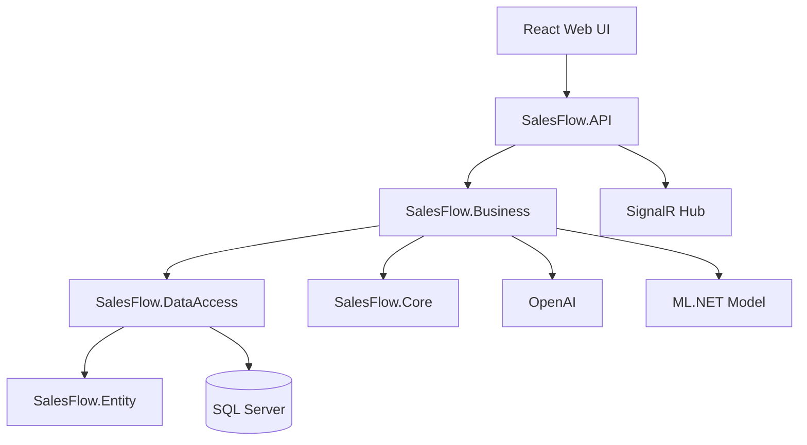

# SalesFlow CRM

<div align="center">

**Satış ekipleri için uçtan uca müşteri, lead, fırsat, görev, toplantı ve raporlama yönetimi sunan modern CRM platformu.**


</div>

---

## 📋 İçindekiler

- [Proje Hakkında](#-proje-hakkında)
- [Öne Çıkan Özellikler](#-öne-çıkan-özellikler)
- [Teknoloji Stack'i](#-teknoloji-stacki)
- [Mimari Yaklaşım](#-mimari-yaklaşım)
- [Modüller](#-modüller)
- [AI ve ML Özellikleri](#-ai-ve-ml-özellikleri)
- [Proje Yapısı](#-proje-yapısı)
- [Kurulum](#-kurulum)
- [API Dokümantasyonu](#-api-dokümantasyonu)
- [Test](#-test)
- [Yol Haritası](#-yol-haritası)

---

## 📖 Proje Hakkında

**SalesFlow**, gerçek bir satış organizasyonunun ihtiyaçları düşünülerek geliştirilmiş, backend ağırlıklı ve React yönetim paneliyle desteklenen bir CRM projesidir. Proje; potansiyel müşterilerin sisteme alınmasından satış fırsatlarının yönetilmesine, toplantı ve görev takibinden müşteri notları, dosya ekleri, etiketleme, dashboard raporları ve gerçek zamanlı bildirimlere kadar kapsamlı bir satış süreci sunar.

Bu projede yalnızca CRUD operasyonları değil; **iş kuralları**, **katmanlı mimari**, **kimlik doğrulama**, **rol bazlı yetkilendirme**, **soft delete**, **audit alanları**, **global hata yönetimi**, **pagination**, **export**, **real-time dashboard güncellemeleri**, **OpenAI destekli içerik üretimi** ve **ML.NET ile lead scoring** gibi gerçek dünya senaryolarında ihtiyaç duyulan birçok konu ele alınmıştır.

> Kısaca: SalesFlow, portföyde gösterilebilecek, LinkedIn'de teknik detaylarıyla paylaşılabilecek ve gerçek bir SaaS CRM ürününe evrilebilecek kapsamda tasarlanmış modern bir full-stack CRM çalışmasıdır.

---

## ✨ Öne Çıkan Özellikler

- **JWT + Refresh Token** ile güvenli oturum yönetimi
- **ASP.NET Core Identity** ile kullanıcı ve rol altyapısı
- **Role Based Authorization** ile yetki kontrollü API uçları
- **Customer, Lead, Deal, Meeting, Task, Note, Attachment, Tag** yönetimi
- **Lead → Customer dönüşüm akışı** ve satış fırsatı oluşturma senaryoları
- **Dashboard API** ile özet metrikler, satış istatistikleri ve son aktiviteler
- **SignalR** ile dashboard ve bildirim tarafında gerçek zamanlı güncelleme altyapısı
- **OpenAI entegrasyonu** ile müşteri takip e-postası üretimi
- **ML.NET lead scoring** ile potansiyel müşterilerin satış olasılığını puanlama
- **Excel ve PDF export** desteği
- **IFormFile tabanlı dosya yükleme** ve attachment yönetimi
- **Global Exception Middleware** ile merkezi hata yönetimi
- **Result Pattern** ile standart API cevap formatı
- **FluentValidation** ile DTO seviyesinde doğrulama
- **Repository + Generic Repository + Unit of Work** ile sürdürülebilir veri erişimi
- **Soft Delete + Global Query Filter** ile güvenli silme stratejisi
- **Audit Interceptor** ile CreatedDate, UpdatedDate ve IsDeleted alanlarının otomatik yönetimi
- **xUnit, Moq, FluentAssertions** ile birim test altyapısı
- **React + TypeScript + Vite + Tailwind CSS** ile modern web arayüzü başlangıcı

---

## 🛠️ Teknoloji Stack'i

### Backend

| Teknoloji | Kullanım Amacı |
| --- | --- |
| ASP.NET Core 10 | REST API ve uygulama host'u |
| Entity Framework Core 10 | ORM ve migration yönetimi |
| SQL Server | İlişkisel veritabanı |
| ASP.NET Core Identity | Kullanıcı, rol ve parola yönetimi |
| JWT Bearer | Access token doğrulama |
| FluentValidation | DTO doğrulama kuralları |
| Mapster | Entity/DTO mapping |
| SignalR | Gerçek zamanlı dashboard/bildirim altyapısı |
| Scalar OpenAPI | API dokümantasyonu |
| ClosedXML | Excel export |
| QuestPDF | PDF export |
| OpenAI SDK | AI destekli metin üretimi |
| ML.NET | Lead scoring tahmini |

### Frontend

| Teknoloji | Kullanım Amacı |
| --- | --- |
| React 19 | Kullanıcı arayüzü |
| TypeScript | Tip güvenliği |
| Vite | Geliştirme ve build aracı |
| Tailwind CSS | Stil sistemi |
| Axios | API haberleşmesi |
| React Router | Sayfa yönlendirme |
| React Hook Form + Zod | Form ve validasyon altyapısı |
| Recharts | Dashboard grafik altyapısı |
| Microsoft SignalR Client | Realtime bağlantı |
| Sonner | Toast bildirimleri |
| Lucide React | İkon seti |

### Test ve Kalite

- xUnit
- Moq
- MockQueryable.Moq
- FluentAssertions
- coverlet.collector

---

## 🏗️ Mimari Yaklaşım

SalesFlow, temiz ve genişletilebilir bir backend mimarisi hedeflenerek katmanlara ayrılmıştır.



### Kullanılan Tasarım ve Altyapı Yaklaşımları

- **N Katmanlı Mimari:** API, Business, DataAccess, Entity ve Core sorumlulukları ayrıştırılmıştır.
- **Repository Pattern:** Her domain için veri erişim sorumluluğu repository sınıflarında toplanmıştır.
- **Generic Repository:** Ortak CRUD davranışları tekrar yazılmadan kullanılabilir hale getirilmiştir.
- **Unit of Work:** Transaction ve `SaveChanges` yönetimi merkezi hale getirilmiştir.
- **Result Pattern:** Servis katmanından dönen sonuçlar standartlaştırılmıştır.
- **Business Rules:** Domain kuralları servislerden ayrılarak okunabilirlik artırılmıştır.
- **Global Exception Middleware:** Validation, business, not found ve beklenmeyen hatalar merkezi biçimde yönetilir.
- **Soft Delete:** Silme işlemleri fiziksel veri kaybı olmadan yapılır.
- **Audit Interceptor:** Oluşturma/güncelleme/silme metadata'ları otomatik işlenir.
- **Global Query Filter:** Soft delete edilmiş kayıtlar normal sorgulardan otomatik dışlanır.
- **Dependency Injection:** Servis, repository, validator ve altyapı bağımlılıkları DI container üzerinden yönetilir.

---

## 📦 Modüller

### Authentication & Authorization

- Kullanıcı kayıt ve giriş işlemleri
- JWT access token üretimi
- Refresh token akışı
- Identity tabanlı rol yönetimi
- Admin, Sales Manager ve Sales Representative rolleri
- Profil görüntüleme ve parola değiştirme

### Customer Management

- Müşteri oluşturma, listeleme, güncelleme ve silme
- Sayfalama ve arama
- Email benzersizlik kontrolü
- Müşteri etiketleme
- Müşteri bazlı not, dosya ve satış fırsatı ilişkileri
- Excel/PDF export
- AI destekli takip e-postası üretimi

### Lead Management

- Potansiyel müşteri oluşturma ve takip
- Lead status ve lead source yönetimi
- Lead scoring ile satış olasılığı tahmini
- Lead → Customer dönüşümü
- Dönüşüm sırasında müşteri, deal, meeting ve task oluşturma senaryoları
- Excel/PDF export

### Deal Management

- Satış fırsatı oluşturma ve takip
- Deal stage yönetimi
- Beklenen kapanış tarihi ve tutar bilgileri
- Müşteri ve sorumlu kullanıcı ilişkileri
- Excel/PDF export

### Meeting Management

- Toplantı planlama
- Online/fiziksel toplantı ayrımı
- Toplantı durum yönetimi
- Sorumlu kullanıcı, müşteri ve lead ilişkileri
- Çakışma kontrolü iş kuralları

### Task Management

- Görev oluşturma ve atama
- Öncelik ve durum yönetimi
- Due date takibi
- Müşteri, lead ve deal bağlantıları

### Note Management

- Müşteri, lead ve deal üzerinde not tutma
- Aktivite geçmişiyle birlikte satış sürecini izlenebilir hale getirme

### Attachment Management

- Dosya yükleme
- Attachment metadata yönetimi
- Statik dosya servis etme altyapısı

### Tag Management

- Etiket oluşturma
- Renk bilgisiyle etiket yönetimi
- Müşterilere çoklu etiket atama

### Dashboard & Activity Log

- Toplam müşteri, lead, deal ve gelir özetleri
- Aylık satış istatistikleri
- Lead, task ve meeting durum dağılımları
- Son aktiviteler
- SignalR ile dashboard güncelleme tetikleri

### Notification Management

- Kullanıcı bazlı bildirim yapısı
- Okundu/okunmadı takibi
- Realtime bildirim senaryolarına uygun altyapı

---

## 🤖 AI ve ML Özellikleri

### OpenAI ile Takip E-postası Üretimi

SalesFlow, müşteri bilgileri ve kullanıcı girdilerini kullanarak profesyonel takip e-postası taslakları üretebilecek şekilde OpenAI servis entegrasyonu içerir. Bu özellik özellikle satış temsilcilerinin görüşme sonrası hızlı, tutarlı ve kişiselleştirilmiş iletişim kurmasına yardımcı olur.

### ML.NET ile Lead Scoring

Projede ML.NET tabanlı bir lead scoring servisi bulunur. Lead verileri model girdisine dönüştürülür, eğitilmiş model üzerinden tahmin alınır ve satış ekibine potansiyel müşterinin önceliklendirilmesi için skor/recommendation mantığı sağlanır.

Ayrıca `SalesFlow.MLTrainer` projesi, model eğitimi ve lead scoring modelinin ayrı bir konsol uygulaması üzerinden yönetilebilmesi için çözümde yer alır.

---

## 📁 Proje Yapısı

```text
SalesFlow
├── SalesFlow.API
│   ├── Controllers
│   ├── Hubs
│   ├── Middlewares
│   ├── Services
│   └── Program.cs
├── SalesFlow.Business
│   ├── Dtos
│   ├── Extensions
│   ├── ML
│   ├── Services
│   └── Validations
├── SalesFlow.Core
│   ├── Exceptions
│   ├── Pagination
│   └── Results
├── SalesFlow.DataAccess
│   ├── Configurations
│   ├── Context
│   ├── Extensions
│   ├── Interceptors
│   ├── Migrations
│   ├── Repositories
│   ├── Seed
│   └── Uows
├── SalesFlow.Entity
│   ├── Common
│   ├── Entities
│   └── Enums
├── SalesFlow.MLTrainer
│   └── Program.cs
├── SalesFlow.WebUI
│   ├── src
│   ├── package.json
│   └── vite.config.ts
└── Tests
    └── SalesFlow.UnitTests
```

---

## 🚀 Kurulum

### Gereksinimler

- .NET 10 SDK
- SQL Server veya SQL Server Express/LocalDB
- Node.js ve npm
- Git

### 1. Repository'yi klonlayın

```bash
git clone <repository-url>
cd SalesFlow
```

### 2. Backend yapılandırması

API projesi `SqlServer`, `Jwt` ve opsiyonel olarak `OpenAi` ayarlarına ihtiyaç duyar. Geliştirme ortamında `user-secrets` kullanılması önerilir.

```bash
cd SalesFlow.API
dotnet user-secrets set "ConnectionStrings:SqlServer" "Server=localhost;Database=SalesFlowDb;Trusted_Connection=True;TrustServerCertificate=True"
dotnet user-secrets set "Jwt:Issuer" "SalesFlow"
dotnet user-secrets set "Jwt:Audience" "SalesFlowClient"
dotnet user-secrets set "Jwt:SecretKey" "change-this-development-secret-key-with-a-long-value"
dotnet user-secrets set "OpenAi:ApiKey" "your-openai-api-key"
```

> OpenAI anahtarı yalnızca AI destekli e-posta üretimi için gereklidir. Bu özelliği kullanmayacaksanız ilgili endpoint'i çağırmadan backend'i çalıştırabilirsiniz.

### 3. Veritabanını oluşturun

Repository kök dizininden:

```bash
dotnet run --project SalesFlow.API
```

### 4. Backend'i çalıştırın

```bash
dotnet run --project SalesFlow.API
```

Varsayılan geliştirme adresleri `launchSettings.json` üzerinden belirlenir. Frontend tarafındaki Axios konfigürasyonu API için `https://localhost:7259/api` adresini kullanır.

### 5. Frontend'i çalıştırın

```bash
cd SalesFlow.WebUI
npm install
npm run dev
```

Vite uygulaması varsayılan olarak `http://localhost:5173` üzerinde çalışır. API tarafında CORS politikası bu adres için yapılandırılmıştır.

### Demo Kullanıcılar

Seed verisiyle oluşturulan kullanıcılar aynı varsayılan parolayı kullanır:

```text
Parola: SalesFlow.2026!
```

Örnek kullanıcılar:

| Rol | Email |
| --- | --- |
| Admin | mehmet.demir@salesflow.com |
| Sales Manager | ayse.yilmaz@salesflow.com |
| Sales Representative | mustafa.kaya@salesflow.com |
| Sales Representative | zeynep.celik@salesflow.com |
| Sales Representative | ali.sahin@salesflow.com |

---

## 📚 API Dokümantasyonu

Development ortamında OpenAPI ve Scalar arayüzü aktiftir.

- OpenAPI JSON: `/openapi/v1.json`
- Scalar API Reference: `/scalar/v1`
- SignalR Hub: `/hubs/salesflow`

Başlıca controller grupları:

- `AuthsController`
- `CustomersController`
- `LeadsController`
- `DealsController`
- `MeetingsController`
- `TaskItemsController`
- `NotesController`
- `AttachmentsController`
- `TagsController`
- `DashboardsController`
- `NotificationsController`
- `ProfilesController`
- `UsersController`
- `ActivityLogsController`

---

## 🧪 Test

Backend testlerini çalıştırmak için:

```bash
dotnet test
```

Frontend build kontrolü için:

```bash
cd SalesFlow.WebUI
npm run build
```

---


<div align="center">

**⭐ Bu projeyi beğendiyseniz yıldız vermeyi unutmayın!**

</div>
